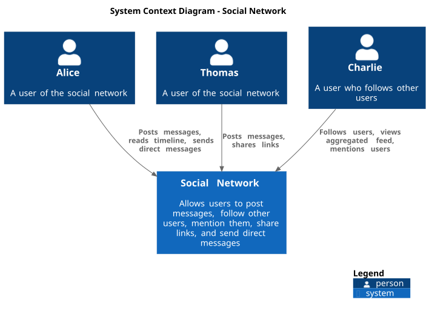

# Chapter 3: System Scope and Context

## 3.1 Business Context

The Social Network kata is a self-contained system with no external integrations.
All actors are human users interacting directly with the system. There are no
third-party services, external APIs, email providers, or push notification systems.

| Actor | Role |
|-------|------|
| **Thomas** | Posts short text messages; his messages may include `@mentions` and URLs. |
| **Alice** | Reads other users' message walls; receives direct messages; can be mentioned. |
| **Charlie** | Follows multiple users and consumes an aggregated chronological feed of their posts; uses `@mention` syntax in his own posts. |

## 3.2 System Context Diagram

> Rendered from [`diagrams/c4-context.puml`](diagrams/c4-context.puml)

The diagram shows three representative users (Thomas, Alice, Charlie) interacting
with the Social Network system. The system has no outbound connections to external
services.

## 3.3 Technical Context

| Interface | Direction | Description |
|-----------|-----------|-------------|
| Python function calls | In → System | Users interact via direct Python API calls (no HTTP, no CLI in the kata). Test code acts as the primary consumer. |
| In-memory state | Internal | All data is held in-memory within the single process. Nothing is read from or written to disk or network. |
