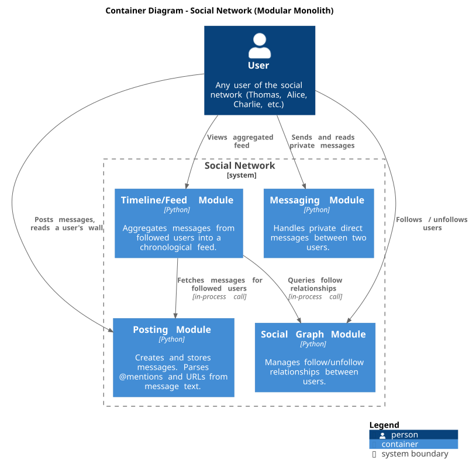
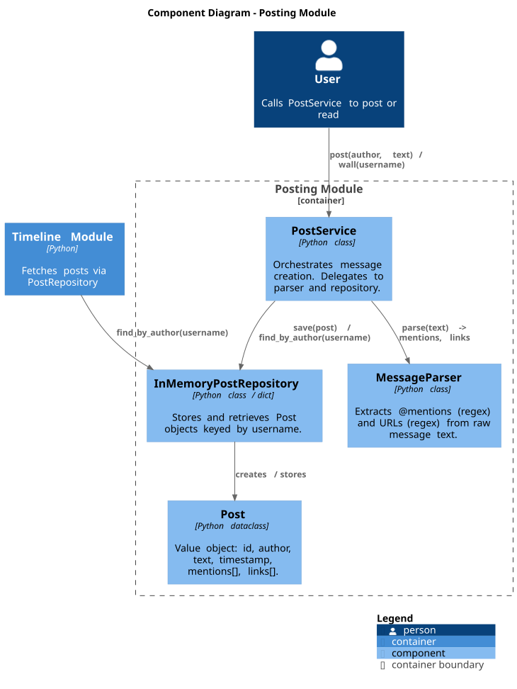
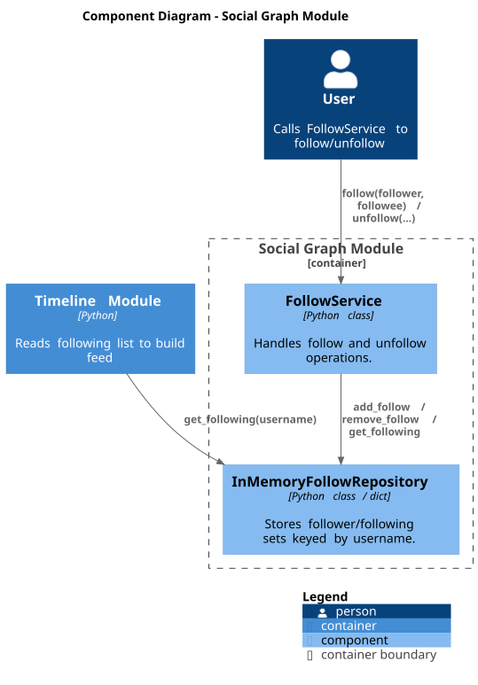
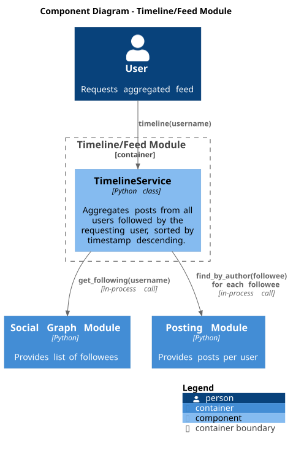
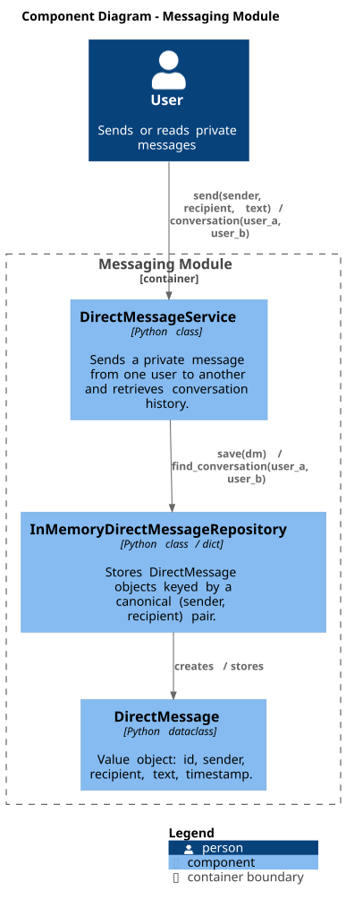

# Chapter 5: Building Block View

## 5.1 Level 1 — Container View

The system is a single Python process containing four modules (containers in C4
terminology), each mapping to one bounded context.

> Rendered from [`diagrams/c4-container.puml`](diagrams/c4-container.puml)



| Container | Responsibility | Key Public API |
|-----------|---------------|----------------|
| **Posting** | Create messages, parse mentions and links, serve a user's wall | `PostService.post()`, `PostService.wall()` |
| **Social Graph** | Track follow/unfollow relationships | `FollowService.follow()`, `FollowService.unfollow()`, `FollowService.following()` |
| **Timeline/Feed** | Aggregate posts from followed users, sorted by time | `TimelineService.timeline()` |
| **Messaging** | Private direct messages between two users | `DirectMessageService.send()`, `DirectMessageService.conversation()` |

---

## 5.2 Level 2 — Component View: Posting Module

> Rendered from [`diagrams/c4-component-posting.puml`](diagrams/c4-component-posting.puml)



| Component | Type | Responsibility |
|-----------|------|----------------|
| `PostService` | Service | Orchestrates posting and wall retrieval. |
| `MessageParser` | Utility | Extracts `@mentions` via `r'@(\w+)'` and URLs via URL regex from raw text. |
| `InMemoryPostRepository` | Repository | Stores `Post` objects in a `dict[str, list[Post]]` keyed by author. |
| `Post` | Dataclass | `id: str, author: str, text: str, timestamp: datetime, mentions: list[str], links: list[str]` |

---

## 5.3 Level 2 — Component View: Social Graph Module

> Rendered from [`diagrams/c4-component-social-graph.puml`](diagrams/c4-component-social-graph.puml)



| Component | Type | Responsibility |
|-----------|------|----------------|
| `FollowService` | Service | Validates and delegates follow/unfollow operations. |
| `InMemoryFollowRepository` | Repository | Stores following sets in `dict[str, set[str]]` keyed by follower username. |

---

## 5.4 Level 2 — Component View: Timeline/Feed Module

> Rendered from [`diagrams/c4-component-timeline.puml`](diagrams/c4-component-timeline.puml)



| Component | Type | Responsibility |
|-----------|------|----------------|
| `TimelineService` | Service | Given a username, fetches the following list from `FollowRepository`, then fetches posts for each followee from `PostRepository`, merges them, and returns them sorted by `timestamp` descending. |

`TimelineService` is constructed with injected repository references:

```python
TimelineService(
    follow_repo: InMemoryFollowRepository,
    post_repo: InMemoryPostRepository,
)
```

---

## 5.5 Level 2 — Component View: Messaging Module

> Rendered from [`diagrams/c4-component-messaging.puml`](diagrams/c4-component-messaging.puml)



| Component | Type | Responsibility |
|-----------|------|----------------|
| `DirectMessageService` | Service | Sends and retrieves private messages. |
| `InMemoryDirectMessageRepository` | Repository | Stores `DirectMessage` objects in `dict[tuple[str,str], list[DirectMessage]]` keyed by a canonical sorted pair of usernames. |
| `DirectMessage` | Dataclass | `id: str, sender: str, recipient: str, text: str, timestamp: datetime` |
