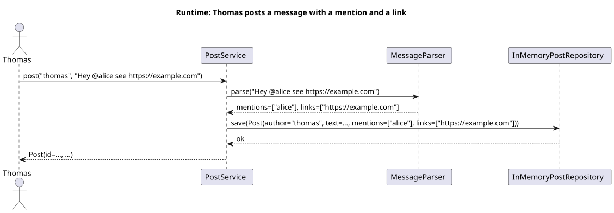
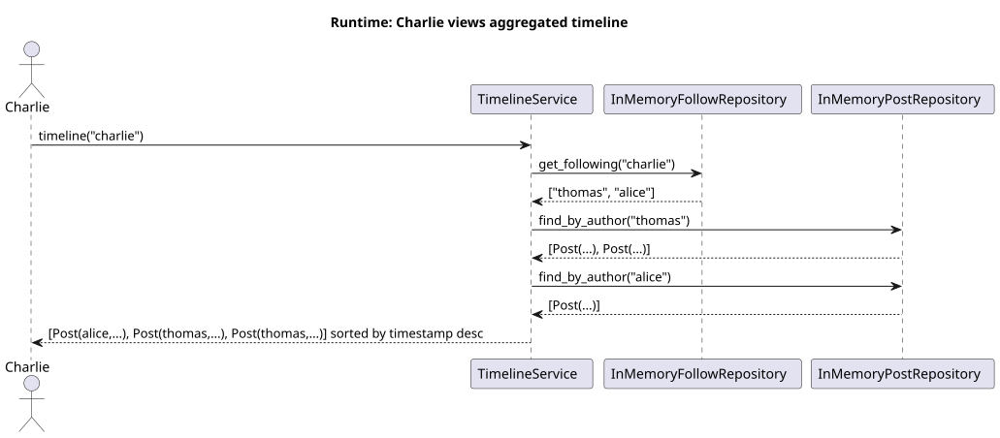
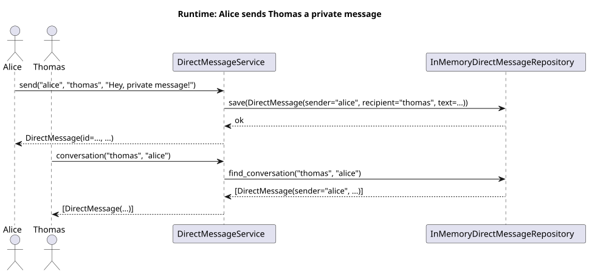

# Chapter 6: Runtime View

Three key runtime scenarios are documented here as sequence diagrams.

---

## 6.1 Scenario: Thomas Posts a Message with a Mention and a Link

Thomas calls `PostService.post()`. The service delegates text parsing to
`MessageParser`, then saves the resulting `Post` (with parsed mentions and links)
to the repository.

> Rendered from [`diagrams/seq-post-message.puml`](diagrams/seq-post-message.puml)

**Notable points:**
- `MessageParser` is a pure function — same input always gives the same output, easy to unit-test in isolation.
- The `Post` returned to the caller is an immutable dataclass snapshot; the repository retains its own copy.

---

## 6.2 Scenario: Charlie Views His Aggregated Timeline

Charlie calls `TimelineService.timeline("charlie")`. The service first resolves
Charlie's following list, then fetches each followee's posts and merges them.

> Rendered from [`diagrams/seq-timeline.puml`](diagrams/seq-timeline.puml)

**Notable points:**
- The number of repository calls is O(n) in the number of users Charlie follows — acceptable for a kata, but worth noting as a scaling concern (see Chapter 11).
- Posts are sorted by `timestamp` descending in memory after all fetches.

---

## 6.3 Scenario: Alice Sends Thomas a Private Direct Message

Alice sends a message via `DirectMessageService.send()`. Thomas later retrieves
the conversation history via `DirectMessageService.conversation()`.

> Rendered from [`diagrams/seq-direct-message.puml`](diagrams/seq-direct-message.puml)

**Notable points:**
- The repository uses a canonical key `tuple(sorted([user_a, user_b]))` so that
  `conversation("alice", "thomas")` and `conversation("thomas", "alice")` return
  the same thread.
- Private messages are never exposed through `PostService` or `TimelineService`.
